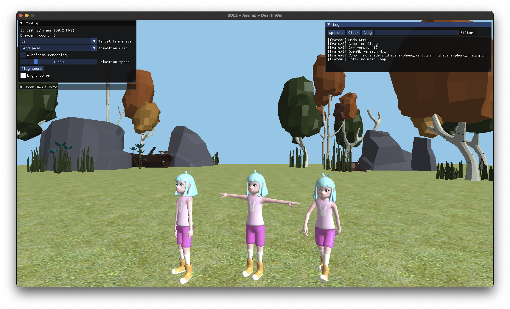
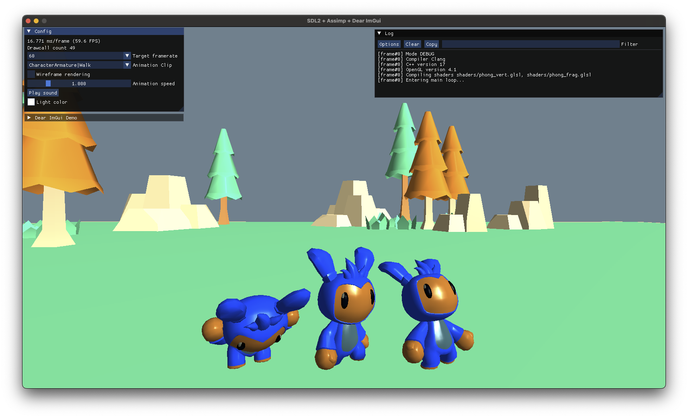

# eduEngine
Course framework for MAU::DA376B

## Requirements
- A compiler that supports C++17
- Source control: [git](https://git-scm.com/)
- Build system: [CMake](https://cmake.org/)
- (Under consideration) Scripting language support [LUA] (https://www.lua.org/)
- Editor or IDE of choice, e.g. Visual Studio, Visual Studio Code (build and launch scripts included), Xcode etc.

## Fetched dependencies
- Backend for window, sound, input etc: [SDL2](https://github.com/libsdl-org/SDL)
- OpenGL extension loader: [glew-cmake](https://github.com/Perlmint/glew-cmake)
- Model loader: [assimp](https://github.com/assimp/assimp) v5.0.1 (200112, newer versions have [issues](https://github.com/assimp/assimp/issues/4620) with Mixamo models).
- User interface: [Dear ImGui](https://github.com/ocornut/imgui)
- Vector & matrix math: [glm](https://github.com/g-truc/glm)
- Image loader & writer: [stb](https://github.com/nothings/stb)
- Entity-Component-System: [EnTT](https://github.com/skypjack/entt)

### Under consideration

- Advanced animation: [ozz-animation](https://guillaumeblanc.github.io/ozz-animation/)
- JSON reader & writer: [nlohmann-json](https://github.com/nlohmann/json)
- File dialog based on Dear ImGui: [ImGuiFileDialog](https://github.com/aiekick/ImGuiFileDialog)
- LUA scripting: [sol2](https://github.com/ThePhD/sol2)

## Build Instructions

An executable target is created for each course module.  
After a successful build, you can find the executables in the respective directories (`Debug` or `Release`).  
A clean build will take some time to complete since all code is compiled from source.  

### Windows

```sh
# Clone the repository
git clone https://github.com/cjgribel/eduEngine.git

# Navigate to the project directory
cd eduEngine

# Debug Build
cmake -B Debug -DCMAKE_BUILD_TYPE=Debug
cmake --build Debug

# Release Build
cmake -B Release -DCMAKE_BUILD_TYPE=Release
cmake --build Release
```

### macOS

```sh
# Clone the repository
git clone https://github.com/cjgribel/eduEngine.git

# Navigate to the project directory
cd eduEngine

# Debug Build
cmake -B Debug -DCMAKE_BUILD_TYPE=Debug
cmake --build Debug

# Release Build
cmake -B Release -DCMAKE_BUILD_TYPE=Release
cmake --build Release
```

### Generator

To select a specific generator (Visual Studio, Unix Makefile etc) use `cmake` e.g. like this,
```sh
cmake -B Debug -G "name-of-generator" -DCMAKE_BUILD_TYPE=Debug
```

where `name-of-generator` is replaced by the name of a supported generator. Use this command to list generators that are available on your system
```sh
cmake --help
```

## Examples

Test scene with elements from [Mixamo](https://www.mixamo.com/) and [Quaternius](https://quaternius.com/).  
  

[Tarisland by Doctor A.](https://sketchfab.com/3d-models/tarisland-dragon-high-poly-ecf63885166c40e2bbbcdf11cd14e65f)  
  

## Credits
- GLDebugMessageCallback by [Plasmoxy](https://gist.github.com/Plasmoxy/aec637b85e306f671339dcfd509efc82) and [liam-middlebrook](https://gist.github.com/liam-middlebrook/c52b069e4be2d87a6d2f)
- [entt-meets-sol2](https://github.com/skaarj1989/entt-meets-sol2)

Updated 240522  
