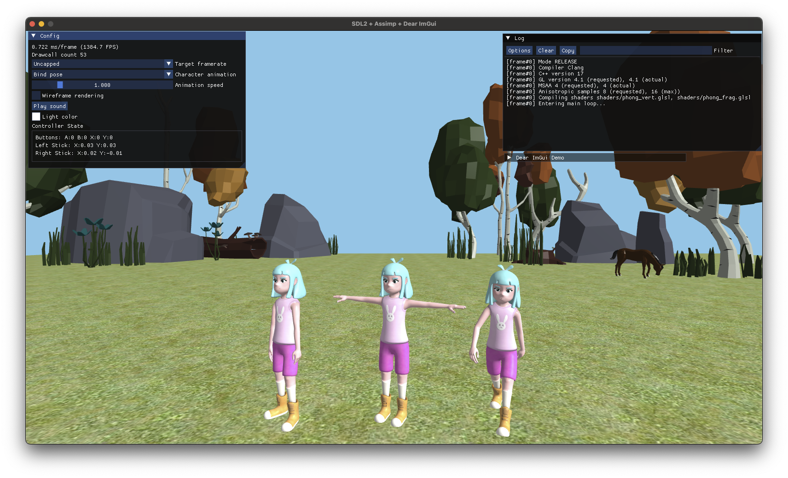
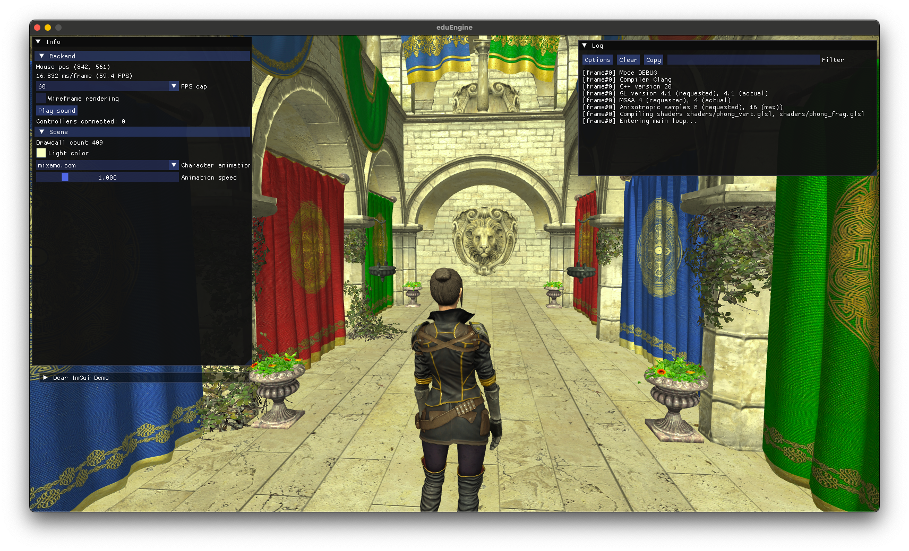

# eduEngine

Course framework for **DA376B Game Engine Architecture**, Malmö University.  
Assets can be downloaded from the course page (not included in the repository).  

## Requirements

- A compiler that supports C++20
- Source control: [git](https://git-scm.com/)
- Build tool: [CMake](https://cmake.org/)
- Editor or IDE of choice, for example -
  - Visual Studio 2022 with the _Desktop development with C++_ workload (this workload includes CMake).
  - Visual Studio Code (Cross Platform). Build and launch scripts included.

### Under consideration

- Scripting: [LUA](https://www.lua.org/)

## Fetched dependencies

- Backend for window, sound, input etc: [SDL3](https://github.com/libsdl-org/SDL)
- OpenGL extension loader: [glew-cmake](https://github.com/Perlmint/glew-cmake)
- Model loader: [assimp](https://github.com/assimp/assimp) (v5.0.1 200112 - newer versions have [issues](https://github.com/assimp/assimp/issues/4620) with Mixamo models).
- User interface: [Dear ImGui](https://github.com/ocornut/imgui)
- Vector & matrix math: [glm](https://github.com/g-truc/glm)
- Image loader & writer: [stb](https://github.com/nothings/stb)
- Entity-Component-System: [EnTT](https://github.com/skypjack/entt)

### Under consideration

- Multi-channel audio mixer: [SDL_mixer](https://github.com/libsdl-org/SDL_mixer) (missing proper cmake support?)
- Advanced animation: [ozz-animation](https://guillaumeblanc.github.io/ozz-animation/)
- JSON reader & writer: [nlohmann-json](https://github.com/nlohmann/json)
- File dialog based on Dear ImGui: [ImGuiFileDialog](https://github.com/aiekick/ImGuiFileDialog)
- LUA binding: [sol2](https://github.com/ThePhD/sol2)

## Build Instructions
> **Note:** A clean build will take some time to complete since dependencies are compiled from source.

### 🖥️ Windows with Visual Studio

```sh
# 1. Open PowerShell and clone the repository
git clone https://github.com/cjgribel/eduEngine.git

# 2. Navigate to the project directory
cd eduEngine

# 3. Generate project
cmake -S . -B Build -G "Visual Studio 17 2022"
```
Now open the Visual Studio solution file, located in `eduEngine/Build`. 
Switch between Debug, Release, or any other configuration as needed. 
Press F5 to Build and Run.

### 🖥️ Cross-Platform with VS Code and Ninja

1. **Install VS Code Extensions:**
   - C/C++ (by Microsoft)

2. Install Ninja. Ninja is a fast, cross-platform build system.
   
   Windows (using [Chocolatery](https://chocolatey.org/install)):
   ```sh
   choco install ninja
   ```
   MacOS (using [Homebrew](https://brew.sh/)):
   ```sh
   brew install ninja
   ```
4. Set up project
   ```sh
   # 1. Open a terminal (on Windows, use Developer Command Prompt) and clone the repository
   git clone https://github.com/cjgribel/eduEngine.git

   # 2. Navigate to the project directory and open VS Code
   cd eduEngine
   code .
   ```
5. In VS Code, use the provided scripts to Configure, Build and Debug the program.  

   > 💡 To run a Task, open the Command Palette with `Cmd+Shift+P` (macOS) or `Ctrl+Shift+P` (Windows), select "Tasks: Run Task", and choose the desired Task.

   > 💡 Launch actions are triggered from the Run and Debug panel (`Shift+Cmd+D`). Select the launch configuration, then press the green arrow or `F5` to launch.

   **Debug mode**:
   - Configure and Build
     - `CMake Configure (Debug) (Ninja)`
     - `CMake Build (Debug)`
   - Launch Debugger
     - `Launch (Debug) (Windows/Linux/macOS)` (choose platform)

   **Release mode**:
   - Configure and Build
     - `CMake Configure (Release) (Ninja)`
     - `CMake Build (Release)`
   - Launch
     - `Launch (Release) (Windows/Linux/macOS)` (choose platform)

### 🖥️ macOS with VS Code and Unix Makefile

> 💡 Unix Makefile projects typically builds much slower than Ninja-based projects.

To use Unix Makefiles for building, follow the same process as for Cross-Platform and use script versions with `(Default Generator)` instead of `(Ninja)` in their names.

### Other Platforms and IDEs

- **Multi-configuration Generators** (Xcode, CLion etc)
  
  The overall workflow should be similar to the one provided for Visual Studio, just set the desired generator (`-G <generator>`) when running CMake.
  
  Example (Xcode):
  ```sh
  cmake -S . -B Build -G Xcode
  ```
- **Single-configuration Generators**
  
  When configuring using CMake, set the desired generator (`-G <generator>`) and use `-DCMAKE_BUILD_TYPE=Debug` or `-DCMAKE_BUILD_TYPE=Release`.

> 💡 Use `cmake --help` to list available generators on your system.

## Documentation

[Doxygen](https://cjgribel.github.io/eduEngine/) _Work in progress_  

Some of the documentation is AI generated.

## Samples (assets not part of repo)
Elements from [Mixamo](https://www.mixamo.com/) and [Quaternius](https://quaternius.com/).  
  

Sponza (Dabrovic, Meinl, McGuire, Hansen) with elements from [Mixamo](https://www.mixamo.com/).  
  

<!--
[Tarisland by Doctor A.](https://sketchfab.com/3d-models/tarisland-dragon-high-poly-ecf63885166c40e2bbbcdf11cd14e65f)  
  
-->

## Other credits

- Thanks to all students who provided feedback on instructions, code etc.
- GLDebugMessageCallback by [Plasmoxy](https://gist.github.com/Plasmoxy/aec637b85e306f671339dcfd509efc82) and [liam-middlebrook](https://gist.github.com/liam-middlebrook/c52b069e4be2d87a6d2f)
- [entt-meets-sol2](https://github.com/skaarj1989/entt-meets-sol2)
